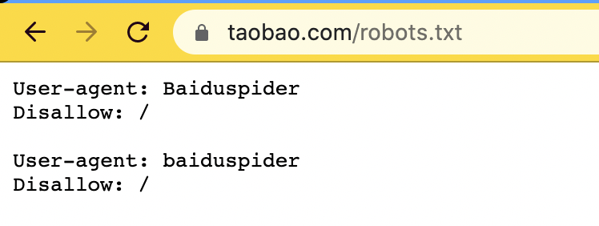

# 第9章 Web 机器人

## 概念

Web 机器人就是我们常称的 Robot、爬虫、蜘蛛、蠕虫等的程序，可以在无人类干预的情况自动进行一系列
Web 事务的处理。

## **场景**

常用的**场景**有搜索引擎、 股票趋势图、Web 统计、购物比价等。

## 爬虫的爬行技术

爬虫的爬行方式是，从一个初始 URL 集合（根集，爬虫产品一般会为用户提供向根集提交新页面或者无名页面的方式）开始，不停的对页面上的
URL 链接分析并且不断向下索引。爬虫需要避免陷入循环（页面
A->B->C->A）导致问题：一个是爬虫自身无法访问别的页面了，另一个是重复访问导致服务器崩溃需要负法律责任，再一个搜索引擎如果全是重复文档，那它就没有使用的价值了。

因特网上 URL 无限多，所以爬虫需要使用一些技术来管理访问过的地址：

- 搜索树和散列表：记录已访问的 URL
- 有损的存在位图：用 hash 函数把 URL 转成数字，然后在数组中有个存在位，访问的 URL 的存在位就被置位
- 检查点：把访问的 list 保存在硬盘上
- 分类：使用集群分别访问不同的 URL 集合

爬虫对于判断是否“访问过”也需要使用某些技术，包括以下技术

- 需要规范化 URL（端口、转义、#标签、IP 和 HOST 映射等等）
- 使用广度优先的爬行（最小化的减少跳入循环陷阱）
- 使用节流限制重复页面和服务器的访问次数
- 限制 URL 长度（因为超长可能是子路径可能是某个祖父节点的符号链接，递归下去 URL 就会越来越长）
- 使用站点黑名单，避开一些有问题的站点。
- 模式检测，检测 URL 中重复字段次数，有字段重复超过两三次的就爬取，因为这种重复可能就是循环导致的。
- 内容指纹，对页面内容使用如 MD5 函数来计算校验和，从而判断是否重复。
- 人工监视，对爬虫的异常行为进行监控报警，然后人工排查。

## 爬虫的 HTTP 技术

爬虫相当于一个 HTTP 客户端，需要支持 HTTP 规范，比如

- 要能发送 User-Agent、From、Accept、Referer首部，给服务器用作基本信息识别。
- 要支持 HOST 首部，避免存在虚拟主机的情况下内容和 URL 映射错误。
- 要支持条件请求和缓存机制，减少机器人重复下载文档。
- 要能正确处理响应，因为返回内容里可能有元标签 http-equiv 附加了一些给机器人的信息

## 爬虫的危害

如果没有正确利用爬虫技术，可能会导致不好的后果，比如如下：

- 爬虫如果写了 bug 或者没有避免循环，可能导致服务器过载，相当于发起了拒绝服务器攻击（DDoS）；
- 如果不定期更新导致很多过期的 URL，这样会使得服务器充斥错误日志和错误页面，也会降低服务器的处理能力。
- 因为 bug 或者没有避免循环，所以给服务器发送超长的 URL，也会降低服务器的处理能力，甚至崩溃
- 不小心收录的隐私数据，而且由于缓存机制，导致隐私数据短时间内都能访问，会导致用户不满
- 不小心访问的是动态网关，造成网关无意义的计算开销

## 拒绝爬虫的方式

有的服务器不希望某些内容被爬虫访问，所以产生了一项简单的自愿约束技术，被称为“拒绝机器人访问标准”，也就是
**robots.txt**

原理很简单，就是在服务器的根目录提供一个可选的 robots.txt 文件，说明可以访问或者拒绝的内容。

爬虫/机器人如果遵循这个标准，就必须在访问服务器前读取
robots.txt 的内容，验证自己的权限。

**案例**：（可能大家都知道，淘宝从08年就开始完全屏蔽且只屏蔽百度搜索引擎…）

对于**Robots.txt 的规则**是：

- 如果没有 robots.txt （404）那就是访问不受限制
- 如果服务器返回401/403，就说明完全限制访问
- 如果服务器返回503就需要等能获取到 robots.txt 再说
- 如果服务器返回3XX，就重定向到指定位置获取 robots.txt
- 如果获取到 robots.txt，就解析其中的内容
    - 只有 User-Agent 声明的机器人才会受到规则约束。
    - Disallow 代表不允许访问的路径，"/" 代表所有路径都不允许
    - Allow 代表允许访问的路径

### 机器人识别的 HTML META 标签：

#### robot-control 元标签

因为robots.txt只能由服务端配置，那前端也需要限制爬虫的话，可以使用 META 标签

<meta name="robots"
content=[指令列表]>，其中指令包含
NOINDEX （不要爬取本文档）、NOFOLLOW（不要爬取本文档的外链链接）、INDEX（可以索引本文档）、FOLLOW（可以爬取外链）、NOARCHIVE（不要缓存本文档）、ALL（相当于
INDEX,FOLLOW）、NONE（相当于NOINDEX,NOFOLLOW）

#### 搜索引擎的 META 标签

为了方便收录和排序，HTML 可以提供description、keywords 等 meta 标签（ 加上文档中通常会有的 title，就是我们常简称为
TDK），但是搜索引擎也会不断优化相关性算法，避免用户刻意欺骗。
