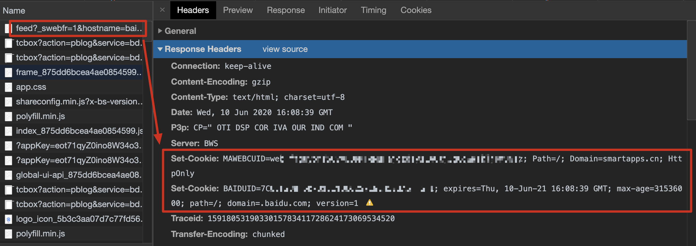

# 第11章 客户端识别与 cookie 机制

HTTP 最初是的设计是无状态的协议，每次请求都是与之前任何请求都无关的独立的事务。

但是随着 Web 的发展，很多网站都希望能够记录用户信息，以提供一些个性化的体验。

比如购物网站就需要根据客户的信息进行一些个性化的产品推荐、保存客户的收货地址和信用卡信息以及购物车的内容等。

早期为了标识用户，网站用了很多识别技术，比如使用携带了来源信息的 HTTP 头、使用用户 IP 区分、让用户登录认证、在 URL 中嵌入识别信息，以及使用 cookie。

其中 cookie 是目前用的最多、最好的一种方式，最初由网景公司开发（也称为 Netscape cookies），现在最新的 cookie 规范是 RFC 6265（HTTP 状态管理机制 [https://tools.ietf.org/html/rfc6265](https://tools.ietf.org/html/rfc6265)）

**cookie 分为会话 cookie 和持久 cookie。**

- 会话 cookie 在用户退出浏览器的时候被删除
    - 响应里设置了 Discard 或者没有设置 Expires 或 Max-Age 参数的，就是会话 cookie。
- 而持久 cookie 会存储在硬盘上。
    - 持久 cookie 需要响应里设置 Expires 或 Max-Age 来说明 cookie 的过期时间时间。

学习打卡  Day 44 《HTTP 权威指南》 第11章 客户端识别与 cookie 机制（下）

**cookie 的工作过程**

- 客户端向服务端发一个正常的请求
- 服务端返回一个响应，使用 Set-cookie 首部传给客户端该用户生成的标识信息，以及 cookie 的域。
    - 如 Set-cookie: id="123"; domain="joes.com"
- 客户端会把服务器给的 cookie 信息以域为 key 存到浏览器 cookie 数据库。在下次再次访问 joes.com 这个域服务器的时候，把 cookie 信息放在 cookie 首部传回去。
    - Cookie: id="123"

**举例：**

该页面的feed 请求，服务器 分别设置了在 smartapps.cn 域下的 cookie 和 在.baidu.com 域下的cookie。

切换到 Application，可以看到 cookie 已经被存储上了

继续看接下来的请求，这个请求是发起到 *.smartapp.cn 服务器的，正好是之前 服务器指定了的域，设置了 name 为 MAWEBCUID 的 cookie，因此客户端就发送了该 cookie。

**cookie （版本0）包含的内容**

- name=value : cookie 的键值对
- domain： cookie 的域属性，用来控制哪些站点才可以发 cookie
- path：cookie 的路径属性，控制特定的路径下才发 cookie
- expires：cookie 的生存期，过期了客户端就不要再发该 cookie 了，没指定的话，会话结束 cookie 就过期
- secure：有该属性，就只有在 HTTPS 情况下才发 cookie

一个完整的例子

- Set-cookie: name=value; expires=GMT; domain=baidu.com; path=/pages; secure

**新版本的 cookie（版本1） 包含的内容**

- name=value
- version： version="1"代表为使用该版本的 cookie，比如上述**图1**中的第2个 set-cookie 就设置了版本1
- comment：服务器注释受要如何使用这个 cookie
- commentURL：服务器提供一个 URL，URL 连接里描述详细的 cookie 策略
- discard：有该属性则代表会话结束 cookie 就过期
- domain
- max-age：用秒为单位表达 cookie 的生存期
- path
- port：指定可以发送 cookie 的端口号
- secure

**带 cookie 的响应的缓存策略**

因为 cookie 涉及安全性，所以对于有 cookie 的情况需要特殊处理其缓存机制。

- 显示标注某文档是否可缓存
    - 使用Cache-Control:no-cache="Set-Cookie"约定除了Set-Cookie首部以外的内容是可缓存的。
    - 使用Cache-Control:public 标识文档可缓存
- 删除 Set-Cookie 首部后缓存主体内容，并且强制重新验证每条请求
- 缓存带 cookie 首部的图片，将过期时间设为0，以强制每次都进行再验证。

**cookie 的安全隐私问题**

由于 cookie 导致一些第三方服务器可以滥用持久 cookie 跟踪和分析用户的行为，其实是存在隐私风险的，但是 98 年风险评估的时候评估结论是没有 cookie 的话，服务器访问日志也是可以分析出的，所以不是 cookie 的问题。

但是现在 Google 去年明确了要移除三方 cookie （[https://blog.chromium.org/2020/01/building-more-private-web-path-towards.html](https://blog.chromium.org/2020/01/building-more-private-web-path-towards.html)），这应该会给广告商带来比较大的打击。
